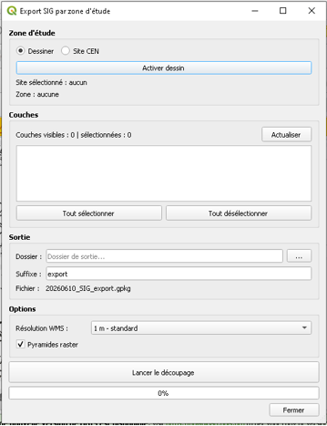

# Export SIG par zone d'étude

Plugin QGIS qui exporte les couches visibles d'un projet, **découpées selon une zone d'étude**, dans un seul fichier **GeoPackage (.gpkg)**.

La zone d'étude peut être :
- **dessinée directement sur la carte** ;
- **un site sélectionné dans la base de données du CEN** (Conservatoire d'espaces naturels).

> Développé lors d'un stage de fin d'études au **CEN Hauts-de-France** (pôle Systèmes d'information).

## Fonctionnalités

- Découpage de plusieurs couches en une seule opération, selon une zone d'étude
- Deux modes de définition de la zone : **Dessiner** ou **Site CEN** (recherche par nom, à partir de 3 lettres)
- Sélection des couches à exporter parmi les couches visibles du projet (vecteurs et couches WMS/WMTS)
- Choix de la résolution des couches WMS à l'export
- Génération de pyramides raster pour un meilleur affichage à petite échelle
- Nom du fichier de sortie généré automatiquement (date du jour + suffixe personnalisable)
- Barre de progression pendant le traitement

## Prérequis

- QGIS 3.x ou QGIS 4.x
- Un projet QGIS contenant les couches à exporter, **visibles** dans le panneau des couches
- Un dossier de sortie accessible en écriture
- Pour le mode **Site CEN** : accès à la base de données du CEN (le mode **Dessiner** fonctionne sans base de données)

## Installation

### Depuis un fichier ZIP

1. Télécharge le fichier ZIP de la dernière version dans l'onglet **Releases** du dépôt.
2. Dans QGIS : **Extensions > Installer/Gérer les extensions > Installer depuis un ZIP**.
3. Sélectionne le fichier ZIP puis clique sur **Installer le plugin**.
4. Le plugin apparaît dans le menu **Extensions > Export SIG par zone d'étude**.

### Installation manuelle

Copie le dossier du plugin dans le dossier des extensions de ton profil QGIS (**Paramètres > Profils utilisateur > Ouvrir le dossier du profil actif**, puis `python/plugins/`). Le dossier doit s'appeler **`export_sig_zone_etude`**. Redémarre QGIS et active l'extension dans le gestionnaire d'extensions.

## Utilisation

1. **Zone d'étude**
   - *Dessiner* : clique sur **Activer dessin**, trace la zone sur la carte et termine avec un clic droit.
   - *Site CEN* : saisis au moins 3 lettres du nom du site, sélectionne-le dans la liste puis valide.
2. **Couches** : coche les couches à exporter (le bouton **Actualiser** met à jour la liste si le projet a changé ; **Tout sélectionner** / **Tout désélectionner** accélèrent la sélection).
3. **Sortie** : choisis le dossier de destination et, si besoin, un suffixe. Le fichier est nommé `AAAAMMJJ_SIG_<suffixe>.gpkg`.
4. **Options** : choisis la résolution WMS et active ou non les pyramides raster.
5. Clique sur **Lancer le découpage**. Le fichier `.gpkg` est créé dans le dossier de sortie.

Avant de lancer, vérifie qu'une zone est définie, qu'au moins une couche est sélectionnée et que le dossier de sortie est renseigné.

## Résultat

Un GeoPackage contenant les couches sélectionnées, découpées selon la zone d'étude. Exemple : `20260609_SIG_export.gpkg`.

## Structure du dépôt

| Fichier | Rôle |
|---|---|
| `export_sig_zone_etude.py` | Point d'entrée du plugin et intégration à QGIS |
| `export_sig_zone_etude_dialog.py` | Fenêtre principale (interface) |
| `export_logic.py` | Logique de découpage et d'export |
| `zone_etude.py`, `outil_dessin.py` | Définition et dessin de la zone d'étude |
| `site_cen_selection_dialog.py` | Recherche et sélection d'un site CEN |
| `compat.py` | Compatibilité entre versions de QGIS |
| `metadata.txt` | Métadonnées du plugin |

## Technologies

Python, PyQGIS, Qt, GeoPackage.

## Auteure

**Ikram Lakriouch** — géomaticienne (SIG, bases de données et qualité des données).

## Licence

Distribué sous licence **GNU GPL v3**. Voir le fichier [LICENSE](LICENSE).
